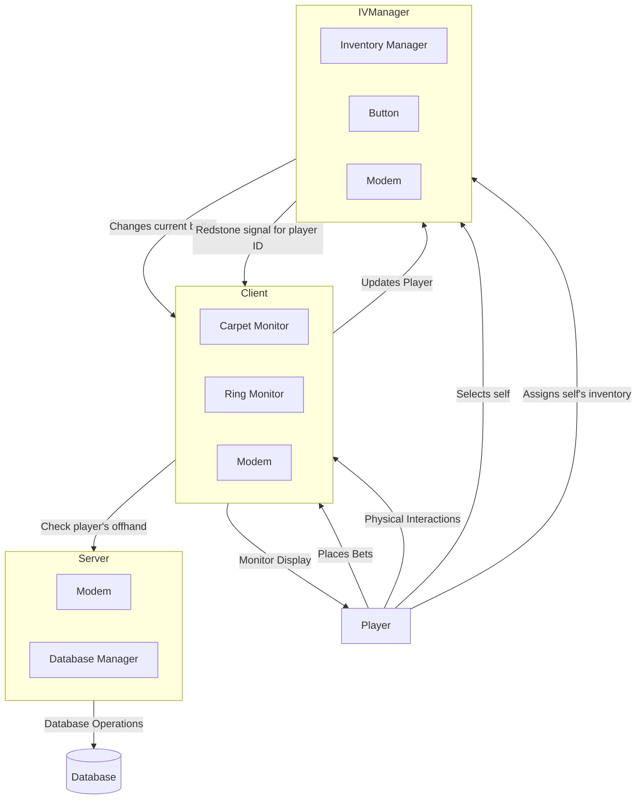
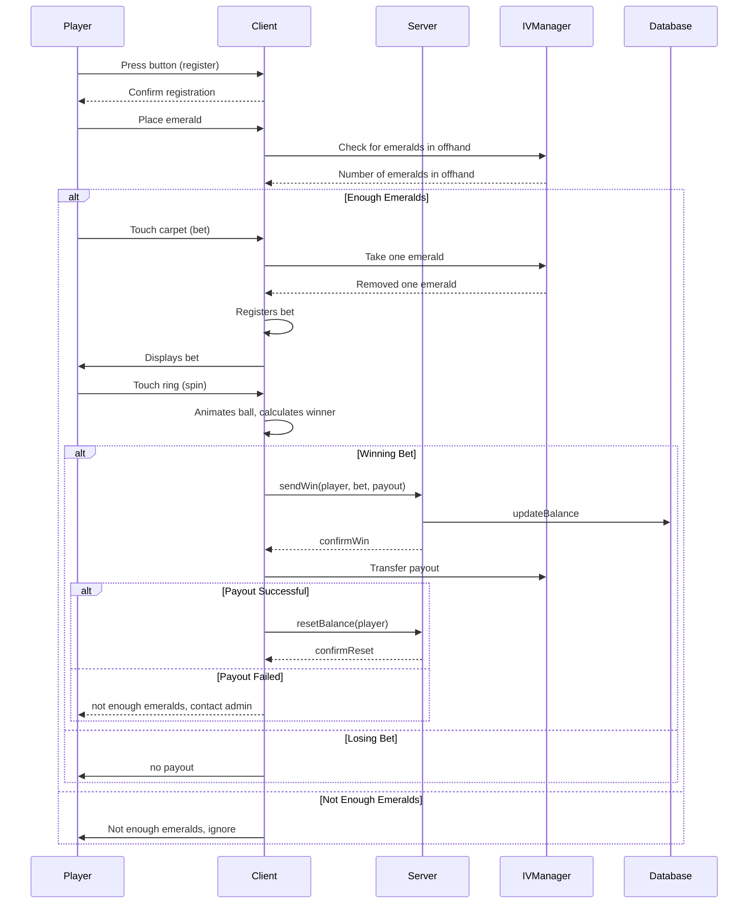
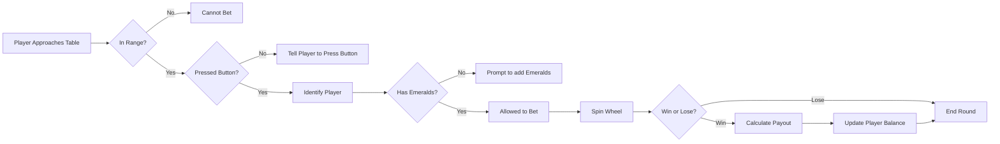
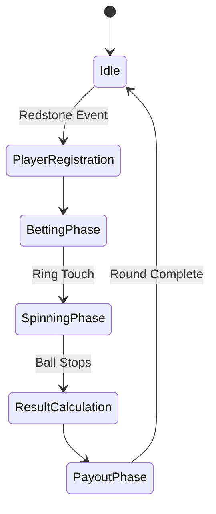

# ToasterGen Spin

ToasterGen Spin is a commissioned roulette game for an in-game ComputerCraft casino. It features a dynamic, animated roulette board along with supporting utilities for archiving and compression, all written in Lua.

## Features

- **Dynamic Roulette Board**:
  Draws a complete roulette ring with animated ball movement and decorative elements (see [`src/ring.lua`](src/ring.lua)). The ring is rendered on a ComputerCraft monitor, utilizing functions to draw elements, lines, and the animated ball. The `launchBall` function animates the ball's movement, and the winning number is highlighted with a blinking effect.

- **Interactive Betting Carpet**:
  Provides a user interface for placing bets, rendered on a separate monitor (see [`src/carpet.lua`](src/carpet.lua)). The carpet module defines the layout of betting options and handles touch events to register bets. The `findClickedNumber` function determines which betting option was selected based on the coordinates of the touch event.

- **Server Communication**:
  Communicates with a central server to manage player balances and process payouts (see [`src/modem.lua`](src/modem.lua) and [`stator.lua`](stator.lua)). The `sendWin`, `getBallance`, and `resetBallance` functions in `modem.lua` handle communication with the server, while `stator.lua` on the server side manages player data and processes requests.

- **Player Detection**:
  Detects players in a defined area using a player detector peripheral. The `stator.lua` script uses the `getPlayersInBorders` function to identify players within the designated zone.

- **Automatic Payouts**:
  The system automatically attempts to payout winnings directly to the player's inventory after each spin. It checks the player's balance and transfers the winnings as emeralds.

- **Configuration**:
  Customizable behaviour and appearance via TOML configuration files (see [`config.toml`](config.toml) and [`tools/config.lua`](tools/config.lua)). The `config.lua` script provides functions for configuring the game's settings, including peripheral devices, reward multipliers, and server parameters.

- **Modular Design**:
  Organized into multiple modules such as [`spin.lua`](spin.lua) for the main game logic, [`carpet.lua`](src/carpet.lua) for the betting carpet, [`ring.lua`](src/ring.lua) for the roulette wheel, and [`chat.lua`](src/chat.lua) for chat integration.

## System Architecture

The ToasterGen Spin system consists of three main components:

1. **Client**: The roulette table itself with monitors for the betting carpet and roulette wheel
2. **Server**: Manages player data, processes bets, and handles payouts
3. **Player Interaction**: Through physical buttons and monitor touches
4. **Inventory Manager**: A physical device that connects to the player's inventory and sends/receives payments directly to/from a client.

### Player Registration Process

Players register for betting through a physical interaction process:

1. Connect their inventory to an Inventory Manager (IV)
2. Press a redstone button located on top of the machine
3. The client detects which button was pressed by reading the redstone signal strength
4. This assigns the player as the current active better, allowing them to place bets

This physical registration process ensures that only players physically present at the machine can place bets and prevents remote exploitation.

### Communication Flow

#### Overall System Architecture



#### Betting and Payout Sequence



#### Player Detection Flow



## Event Handling

The game uses ComputerCraft's event system to handle user input and peripheral events. The main loop in `spin.lua` listens for `redstone` and `monitor_touch` events.

- **Redstone Events**: Triggered when a player presses a button to register for betting.
- **Monitor Touch Events**: Triggered when a player touches the betting carpet or the roulette wheel.

### Event Flow



## Technical Implementation

### Redstone Signal Detection

The system identifies which player is interacting with the machine through redstone signal strength:

1. Each inventory manager is mapped to a specific signal strength
2. When a player presses the button, it produces a specific signal strength
3. The client reads this signal via `redstone.getAnalogInput(config.devices.redstone)`
4. The `currentBetter` variable is set to the corresponding player index
5. Formula: `id = redStreingth - config.devices.ivmanBigger` (base signal strength subtracted from signal)

This approach allows multiple IV managers to be connected to the same system but still uniquely identify each player.

### Modem Communication Protocol

The client and server communicate using the ComputerCraft modem peripheral on channel 1.

**Message Format:**

```txt
Message {
  type: string        // Request type (e.g., "win", "balance", "resetBalance")
  player?: string     // Player name
  bet?: Bet           // Bet information
  payout?: number     // Payout amount
  startPos?: Position // For player detection
  endPos?: Position   // For player detection
}

Response {
  type: string        // Response type (e.g., "winRes", "balanceRes")
  code: number        // HTTP-like status code
  message: string     // Status message
  balance?: number    // For balance responses
  players?: string[]  // For player detection responses
  numberOfPlayers?: number // Count of players detected
}
```

## Usage

- Run the game by executing `spin.lua` on your ComputerCraft setup.
- Customize behaviour and appearance via the configuration file.
- Explore and test individual components in the [`tests`](tests/) directory.

## Licence

Distributed under the GNU Lesser General Public Licence. See [LICENCE](LICENCE) for details.
Enjoy your spin and happy coding!

'lua-toml' is licensed under [MIT](https://opensource.org/licenses/MIT).

```txt
Copyright (c) 2017 Jonathan Stoler

Permission is hereby granted, free of charge, to any person obtaining a copy of this software and associated documentation files (the "Software"), to deal in the Software without restriction, including without limitation the rights to use, copy, modify, merge, publish, distribute, sublicense, and/or sell copies of the Software, and to permit persons to whom the Software is furnished to do so, subject to the following conditions:

The above copyright notice and this permission notice shall be included in all copies or substantial portions of the Software.

THE SOFTWARE IS PROVIDED "AS IS", WITHOUT WARRANTY OF ANY KIND, EXPRESS OR IMPLIED, INCLUDING BUT NOT LIMITED TO THE WARRANTIES OF MERCHANTABILITY, FITNESS FOR A PARTICULAR PURPOSE AND NONINFRINGEMENT. IN NO EVENT SHALL THE AUTHORS OR COPYRIGHT HOLDERS BE LIABLE FOR ANY CLAIM, DAMAGES OR OTHER LIABILITY, WHETHER IN AN ACTION OF CONTRACT, TORT OR OTHERWISE, ARISING FROM, OUT OF OR IN CONNECTION WITH THE SOFTWARE OR THE USE OR OTHER DEALINGS IN THE SOFTWARE.
```
